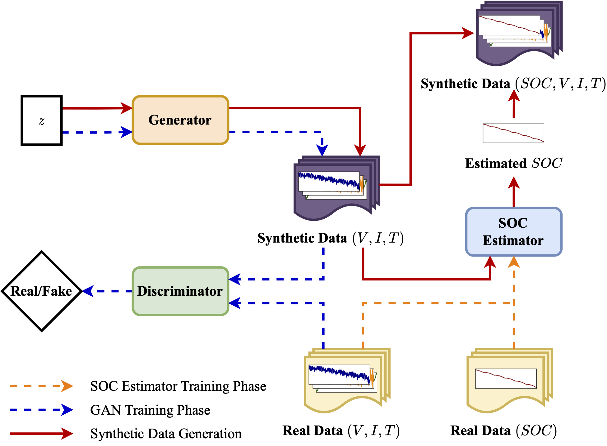

# Synthetic Battery Data
Generation of synthetic battery operation data using a generative adversarial network (GAN) and a state-of-charge (SOC) estimator.

<!--  -->

  

## Introduction

This repository provides the implementation of a fusion approach combining a GAN and an SOC estimator for synthetic battery operation data generation.
The experiment is performed on the public battery dataset: [**LG 18650HG2 Li-ion Battery Data**](https://data.mendeley.com/datasets/cp3473x7xv/3).

## Publication

The work shown here is an implementation from a research article that is currently being reviewed:

*A Novel Fusion Approach Consists of GAN and State-of-Charge Estimator for Synthetic Battery Operation Data Generation*

## Source code structure

## Quick start